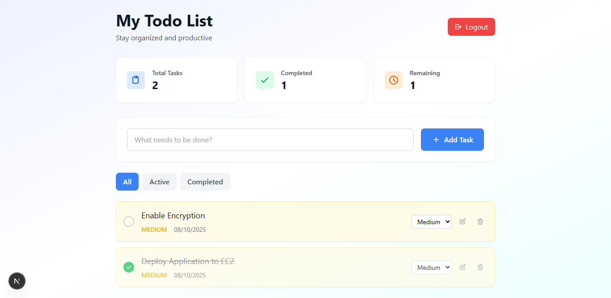
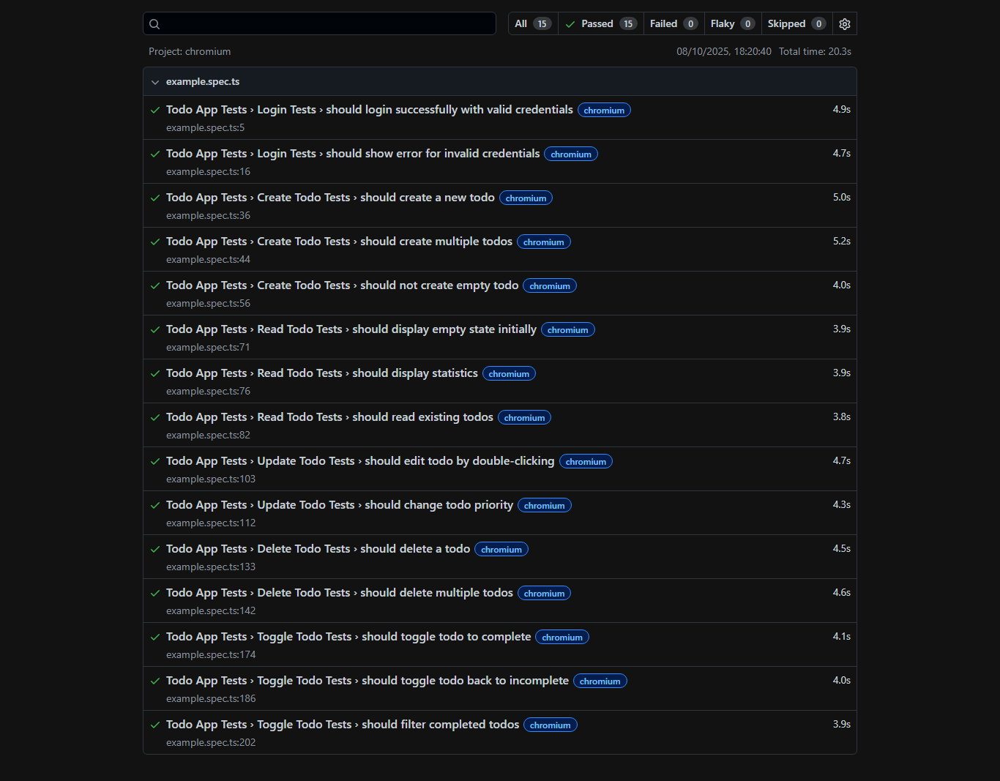

# Todo List App

A modern, secure todo list application built with Next.js, featuring authentication, CRUD operations, and comprehensive testing.

## Security Issue & Resolution

**Critical Security Flaw Fixed**: The app was vulnerable to CVE-2025-29927 - a Next.js middleware authorization bypass that allowed attackers to skip authentication checks by manipulating the `x-middleware-subrequest` header.

**Resolution**: Upgraded Next.js from 14.0.0 to 15.5.4 to patch the vulnerability and secure the authentication flow.

## Features

### Authentication
- Secure login system with cookie-based authentication
- Protected routes with middleware validation
- Session management with automatic logout

### Todo Management
- **Create**: Add new todos with priority levels (Low, Medium, High)
- **Read**: View todos with filtering (All, Active, Completed)
- **Update**: Edit todos by double-clicking, change priorities
- **Delete**: Remove todos with confirmation
- **Toggle**: Mark todos as complete/incomplete

### User Interface
- Modern, responsive design with Tailwind CSS
- Real-time statistics dashboard
- Priority-based color coding
- Local storage persistence
- Smooth animations and transitions



## Test Coverage

Comprehensive Playwright test suite with **15 tests** covering all functionality:

### Login Tests (2 tests)
- Valid credentials authentication
- Invalid credentials error handling

### Create Todo Tests (3 tests)
- Single todo creation
- Multiple todos creation
- Empty todo prevention

### Read Todo Tests (3 tests)
- Empty state display
- Statistics dashboard
- Todo content display

### Update Todo Tests (2 tests)
- Double-click editing
- Priority level changes

### Delete Todo Tests (2 tests)
- Single todo deletion
- Multiple todos deletion

### Toggle Todo Tests (3 tests)
- Mark as complete
- Mark as incomplete
- Filter by completion status



**Result**: All 15 tests passed successfully

## Technology Stack

- **Frontend**: Next.js 15.5.4, React, TypeScript
- **Styling**: Tailwind CSS
- **Testing**: Playwright
- **Authentication**: Cookie-based with middleware
- **Storage**: Local Storage for persistence

## Getting Started

1. Install dependencies:
```bash
npm install
```

2. Run the development server:
```bash
npm run dev
```

3. Run tests:
```bash
npx playwright test
```

4. Access the app at `http://localhost:3000`

## Demo Credentials

- **Username**: `user`
- **Password**: `password`

## Usage

1. Login with demo credentials
2. Add new todos using the input field
3. Set priority levels (Low, Medium, High)
4. Mark todos as complete by clicking the checkbox
5. Edit todos by double-clicking
6. Filter todos by status (All, Active, Completed)
7. Delete todos using the delete button
8. View statistics in the dashboard

## Security Measures

- Upgraded to Next.js 15.5.4 to patch CVE-2025-29927
- Middleware-based route protection
- Client-side authentication validation
- Secure cookie handling
- Input validation and sanitization

## Test Results

All 15 Playwright tests pass successfully, ensuring:
- Complete CRUD functionality
- Authentication flow
- UI interactions
- Data persistence
- Error handling
- Responsive design

The application is production-ready with comprehensive test coverage and security patches applied.
